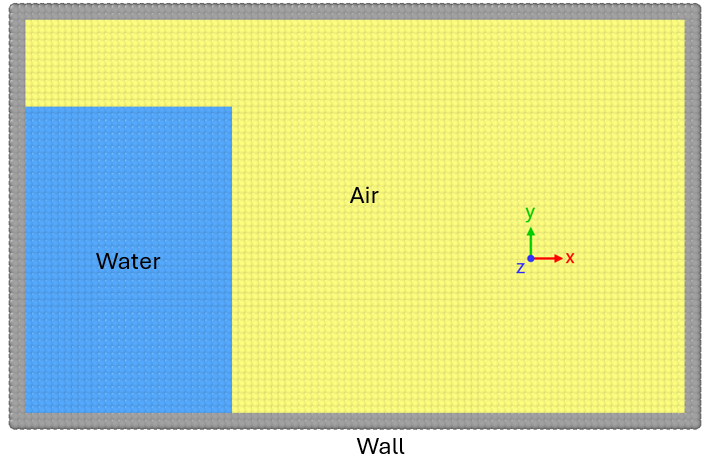

Tutorial 1: Create 2D dam break
==================================================

In this tutorial, we will create the initial state for a two-phase gas-liquid dam break simulation using GeoParticle.
The expected result is as follows:

===================================
Obtain all the particle coordinates
===================================

First, we need to import the necessary libraries and set up the simulation parameters:

.. code-block:: python
   import numpy as np
   from lammps import lammps
   import geoparticle as gp
   
   dl = 1e-4 # particle spacing
   l_box = 0.01 # lengt of the box
   h_box = 0.006 # height of the box
   l_water = 0.003 # length of the water column
   h_water = 0.0045 # height of the water column
   n_thick = 2 # number of particles in thickness direction

Create the geometry of the solid wall:

.. code-block:: python
   wall = gp.ThickRectangle(l_box, h_box, n_thick, 0, 'z', dl, 'wall')

One may ask where the wall is located. All the geometries are created by positioning their centers
(for solids of revolution) or vertices (for other solids like the block). See the doc of certain geometries
for how they are postioned related to the origin. Geoparticle typically does not provide
any parameter to control the absolute position of the geometry. Instead, we can always use the ``shift`` method to
move the geometry to the desired location.

Now we should move the water region ``dl`` to the right and ``dl`` up to avoid overlapping
with the wall, as well as the gas. To create the gas, we can create a large rectangle
and subtract the water region from it:

.. code-block:: python
   water = gp.FilledRectangle(l_water, h_water, 0, 'z', dl, name='water').shift(x=dl, y=dl)
   gas = gp.FilledRectangle(
       l_box - 2 * dl, h_box - 2 * dl, 0, 'z', dl, name='gas'
   ).shift(x=dl, y=dl).subtract(water, rmax=1e-6)

Now we have obtained all the particle coordinates.

==========================
Create particles in LAMMPS
==========================

We should first create a LAMMPS instance:

.. code-block:: python
   lmp = lammps(cmdargs=['-screen', 'none', '-log', 'none'])

Now create the simulation box. We can leave some buffer between the geometries and the box boundaries:

.. code-block:: python
   fac_buf = 1
   xlo = wall.xs.min() - wall.xs.max() * fac_buf
   xhi = wall.xs.max() * (1 + fac_buf)
   ylo = wall.ys.min() - wall.ys.max() * fac_buf
   yhi = wall.ys.max() * (1 + fac_buf)
   zlo = -3e-4
   zhi = 3e-4
   lmp.commands_string(f"""
   dimension	2
   atom_style   rheo
   units		si
   newton	 	on
   boundary	    f f p
   comm_modify  vel yes
   region       simulation_box block {xlo} {xhi} {ylo} {yhi} {zlo} {zhi}
   create_box   3 simulation_box
   """)

Now we can create particles for each geometry.
The required method is `create_atoms <https://docs.lammps.org/Python_module.html#lammps.lammps.create_atoms>`_, which takes
the number of atoms, their IDs, types, and coordinates as input arguments.
We can use the ``flatten_coords`` property of each geometry to get the coordinates in the required format.

.. code-block:: python
   n_atoms_wall = wall.size
   lmp.create_atoms(
       n_atoms_wall, np.arange(n_atoms_wall) + 1 + lmp.get_natoms(),
       np.full(n_atoms_wall, 1, dtype=int), wall.flatten_coords)
   n_atoms_water = water.size
   lmp.create_atoms(
       n_atoms_water, np.arange(n_atoms_water) + 1 + lmp.get_natoms(),
       np.full(n_atoms_water, 2, dtype=int), water.flatten_coords)
   n_atoms_gas = gas.size
   lmp.create_atoms(
       n_atoms_gas, np.arange(n_atoms_gas) + 1 + lmp.get_natoms(),
       np.full(n_atoms_gas, 3, dtype=int), gas.flatten_coords)
   n_atoms_all = lmp.get_natoms()
   log_n_atom = f'n_atoms_wall: {n_atoms_wall},' \
                f' n_atom_water: {n_atoms_water}' \
                f' n_atoms_all: {n_atoms_all}.'
   print(log_n_atom)

Save the data file for LAMMPS for ensuing visualization and simulation.
Note that we must assign mass to each particle before writing the data file.

.. code-block:: python
   m0_fluid = dl ** 2 * 993
   m0_gas = dl ** 2 * 1.1
   lmp.commands_string(f"""
   mass 1*2 {m0_fluid}
   mass 3 {m0_gas}
   run 0
   write_data gas_liquid_dam2D.data
""")

Geoparticle provides ``check_overlap`` method to check whether a geometry have overlapping particles.
To check the overlapping particles in the entire system, we can use LAMMPS commands to delete overlapping atoms.
If the number of atoms remains the same after deleting overlapping atoms, then there is no overlapping atoms

.. code-block:: python
   # check atom overlapping
   lmp.commands_string(f"""
   pair_style      zero {dl * 2}
   pair_coeff      * *
   neighbor        {dl * 0.1} bin
   delete_atoms    overlap {dl * 0.8} all all
   """)
   n_atoms_all_now = lmp.get_natoms()
   if n_atoms_all == n_atoms_all_now:
       print('Congrats, no atoms are overlapped!')
   else:
       raise RuntimeError(f'{n_atoms_all - n_atoms_all_now} atoms are overlapped!')