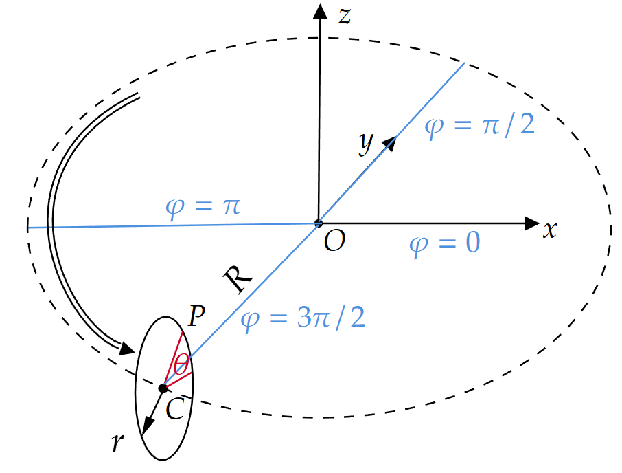

Tutorial 2: Create a 3D intestine connected with an inlet and and outlet
=========================================================================

In this tutorial, a 3D small intestine (type 2, referred to as ``si`` in the code)
will be created which is connected with an inlet and an outlet (type 1).
Fluid (type 3) will also be filled with the intestine. 
It is a part of my unpublished work.

The expected result is as follows:

.. image:: static/dimension-intestine.png

What we will learn in this tutorial:

- Creating 3D geometries: ``CylinderSide``, ``TorusSurface``, and ``FilledCylinder``
- Performing operations: ``mirror`` and ``Union``
- Accessing ``Geometry`` class member: ``zs``

===================================
Specify the parameters
===================================

Like Tutorial 1, let's first import the necessary libraries and set up the simulation parameters:

.. code-block:: Python
   :linenos:

   import geoparticle as gp
   from lammps import lammps
   import numpy as np
   
   rho_fluid = 993
   rho_wall = 1040
   l_pipe_hrz = 0.002
   l_pipe_vert = 0.004
   r_si = 0.002
   r_torus = 2 * r_si
   dl = 2e-4
   l_si = 0.02 - dl

===================================
Obtain all the particle coordinates
===================================

We will first create the inlet, then the intestine, and finally the outlet.
The outlet is a mirror of the inlet, which can be created by using the ``mirror`` operation.
The inlet is composed of a verticle pipe, a torus bend, and a horizontal pipe, with the same
radius ``r_si``.

.. code-block:: python
   :linenos:

   pipe_in_vert = gp.CylinderSide(
       r=r_si, # radius of the cylinder
       l_axis=l_pipe_vert, # length along the cylinder axis
       dl=dl, # particle spacing
       axis='z' # cylinder axis direction
   ).shift(x=-r_torus - l_pipe_hrz, z=r_torus)
   l_pipe_vert = pipe_in_vert.l_axis
   n_ring = pipe_in_vert.n_ring

Although we have defined the length of the vertical pipe as ``l_pipe_vert``,
the actual length may be slightly different. So we update the variable ``l_pipe_vert`` here.

Now create the torus bend. 
But we should know how geoparticle defines the torus first.
The torus is created by revolving a circle along a circular path.
There two circles: the circle to be revolved and the path circle.
The former is called the cross-section circle, whose radius is the minor
radius :math:`r` and the center angle is :math:`\theta`.
The latter is called the path circle, whose radius is the major
radius :math:`R` and the center angle is :math:`\varphi`.

According to our dimension specification,
the minor radius is ``r_si``, and the major radius is ``r_torus``.
:math:`\varphi` ranges from 180 to 270 degrees.

.. code-block:: python
   :linenos:
   
   torus_in = gp.TorusSurface(
       r_minor=r_si,  # minor radius
       r_major=r_torus,  # major radius
       dl=dl,  # particle spacing
       n_ring=n_ring,  # number of particle rings along minor circle
       phi_range='(180,270)',  # angle range along major circle
       plane='XOZ'  # plane where the major circle lies
   ).shift(z=r_torus, x=-l_pipe_hrz)
   
Interval notation is used to define the range of :math:`\varphi`.
That is, ``[`` and ``]`` mean including the boundary, 
while ``(`` and ``)`` mean excluding the boundary.
We exclude the boundaries here to avoid overlapping with the two pipes.
Alternatively, one can set ``phi_range='(180,270]'``,
reduce the length of the horizontal pipe by ``dl``, and move it ``dl`` to the right accordingly.

Finally, create the horizontal pipe:

.. code-block:: python
   :linenos:
   
   pipe_in_hrz = gp.CylinderSide(
       r=r_si, l_axis=l_pipe_hrz - dl, dl=dl, axis='x', name='pipe_in_hrz'
   ).shift(x=-l_pipe_hrz)

Now we can assemble the three parts into an inlet:

.. code-block:: python
   :linenos:
   
   inlet = gp.Union((pipe_in_vert, torus_in, pipe_in_hrz))

Like the subtraction operation, there are three more ways to perform union:

- ``inlet = pipe_in_vert.union(torus_in, pipe_in_hrz)``

- ``inlet =  pipe_in_vert + torus_in + pipe_in_hrz``

- .. code-block:: python
     :linenos:
     
     inlet = pipe_in_vert.copy()
     inlet += torus_in
     inlet += pipe_in_hrz

Next, create the intestine.
In case the length of the intestine changed due to particle discretization, we update
the variable ``l_si`` here.

.. code-block:: python
   :linenos:

   si = gp.CylinderSide(r=r_si, l_axis=l_si, dl=dl, axis='x')
   l_si = si.l_axis

The outlet can be created by mirroring the inlet along the ``yz`` plane positioned at
the middle of the intestine:

.. code-block:: python
    :linenos:

    outlet = inlet.mirror(plane_name='YOZ', plane_pos=l_si / 2)

Finally, create the fluid that fills the intestine, which is a cylinder
with a radius of ``r_si - dl`` to avoid overlapping with the intestine wall.

.. code-block:: python
   :linenos:

   fluid = gp.FilledCylinder(r_si - dl, l_si, dl, axis='x', name='fluid')

==========================
Create particles in LAMMPS
==========================

Now we can create the particles in LAMMPS. This part is similar to Tutorial 1.
I will skip the explanation here.

.. code-block::
   :linenos:

   lmp = lammps(cmdargs=['-screen', 'none', '-log', 'none'])
   # This buffer is between the geometry bound and the bound of the simulation box
   buffer_region = 0.1 * l_si
   xlo = -(l_pipe_hrz + r_torus + r_si) - buffer_region
   xhi = l_si + l_pipe_hrz + r_torus + r_si + buffer_region
   ylo = -r_si - buffer_region
   yhi = r_si + buffer_region
   zlo = -r_si - buffer_region
   zhi = l_pipe_vert + r_torus + buffer_region
   
   lmp.commands_string(f"""
   dimension	3
   atom_style  rheo
   units		si
   newton	 	on
   boundary	f f f
   comm_modify vel yes
   region      simulation_box block {xlo} {xhi} {ylo} {yhi} {zlo} {zhi}
   create_box  3 simulation_box
   """)
   n_atoms_inlet = inlet.size
   lmp.create_atoms(
       n_atoms_inlet, np.arange(n_atoms_inlet) + 1 + lmp.get_natoms(),
       np.ones(n_atoms_inlet, dtype=int), inlet.flatten_coords)
   n_atoms_si = si.size
   lmp.create_atoms(
       n_atoms_si, np.arange(n_atoms_si) + 1 + lmp.get_natoms(),
       np.full(n_atoms_si, 2, dtype=int), si.flatten_coords)
   n_atoms_outlet = outlet.size
   lmp.create_atoms(
       n_atoms_outlet, np.arange(n_atoms_outlet) + 1 + lmp.get_natoms(),
       np.ones(n_atoms_outlet, dtype=int), outlet.flatten_coords)
   n_atoms_fluid = fluid.size
   lmp.create_atoms(
       n_atoms_fluid, np.arange(n_atoms_fluid) + 1 + lmp.get_natoms(),
       np.full(n_atoms_fluid, 3, dtype=int), fluid.flatten_coords)
   n_atoms_all = lmp.get_natoms()
   log_n_atom = f'n_atoms_inlet: {n_atoms_inlet},' \
                f' n_atoms_si: {n_atoms_si},' \
                f' n_atoms_outlet: {n_atoms_outlet},' \
                f' n_atoms_fluid: {n_atoms_fluid},' \
                f' n_atoms_all: {n_atoms_all}.'
   print(log_n_atom)
   
   lmp.commands_string(f"""
   mass            * 1
   set             group all rheo/rho {rho_fluid}
   """)
   
   filename = 'intestine3D'
   lmp.commands_string(f"""
   pair_style      zero {dl * 2}
   pair_coeff      * *
   neighbor        {dl * 0.1} bin
   run             0
   write_data      {filename}.data
   """)
   
   # check atom overlapping
   lmp.commands_string(f"""
   delete_atoms    overlap {dl * 0.8} all all
   """)
   n_atoms_all_now = lmp.get_natoms()
   if n_atoms_all == n_atoms_all_now:
       print('Congrats, no atoms are overlapped!')
   else:
       raise RuntimeError(f'{n_atoms_all - n_atoms_all_now} atoms are overlapped!')