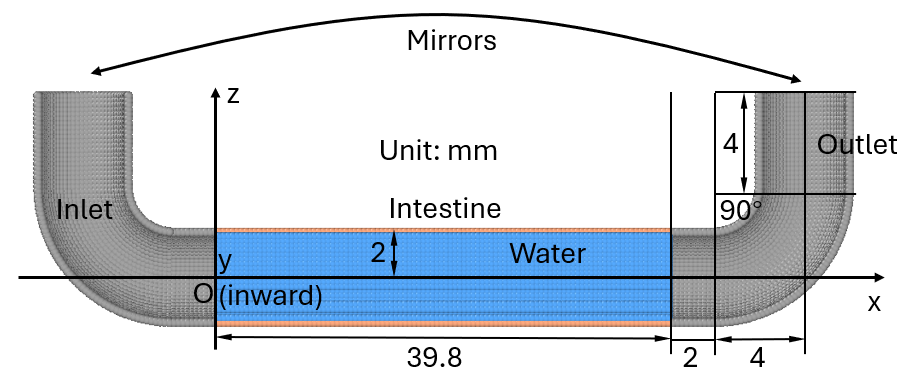

Tutorial 2: Create a 3D intestine connected with an inlet and and outlet
=========================================================================

In this tutorial, a 3D intestine (type 2) will be created which is connected with an inlet and an outlet (type 1).
Fluid (type 3) will also be filled with the intestine. 
It is a part of my unpublished work.

The expected result is as follows:

Geoparticle elements we will learn in this tutorial include:
???

===================================
Specify the parameters
===================================

Like Tutorial 1, let's first import the necessary libraries and set up the simulation parameters:

.. code-block:: Python
   :linenos:

   import geoparticle as gp
   from lammps import lammps
   import numpy as np
   
   rho_fluid = 993
   rho_wall = 1040
   l_pipe_hrz = 0.002
   l_pipe_vert = 0.004
   r_si = 0.002
   r_torus = 2 * r_si
   dl = 2e-4
   l_si = 0.02 - dl

===================================
Obtain all the particle coordinates
===================================

We will first create the inlet, then the intestine, and finally the outlet.
The outlet is a mirror of the inlet, which can be created by using the ``mirror`` operation.
The inlet is composed of a verticle pipe, a torus bend, and a horizontal pipe, with the same
radius ``r_si``.