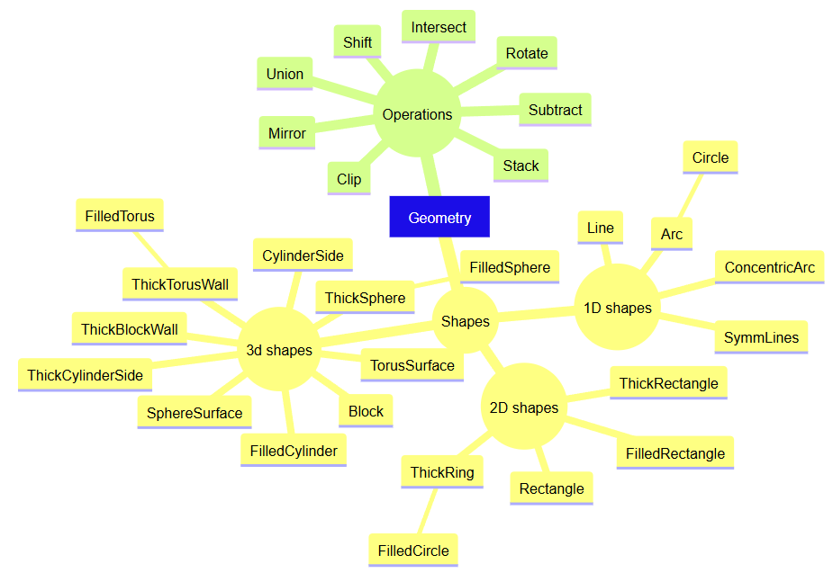

Class topology
================

All the square nodes in the above diagram are geoparticle classes. 
The base class is ``Geometry``.
All other geometry classes inherit from it either directly (e.g., ``Clip``, ``Line``)
or indirectly (e.g., ``FilledCircle``).
